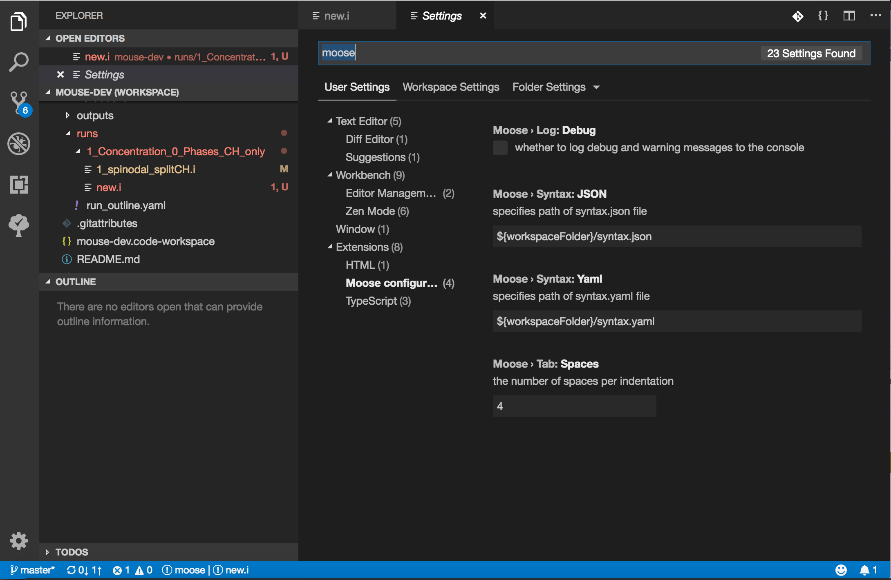

# VSCode for MOOSE

This extension provides language support and IntelliSense for input files of MOOSE (Multiphysics Object Oriented Simulation Environment) applications.

<aside class="notice">
<b>Note</b>: A major API change occurred in v0.7.0
</aside>

## Features

- Syntax Highlighting
- [Autocompletion](#auto-completion)
- Code-Folding
- Outline Tree
- Hover Definitions
- [File Diagnostics](#file-diagnostics)
- [Format Document](#auto-formatting)
- Peek/GoTo Source Files

### Auto Completion Demo

### Introspection Demo

## Loading MOOSE Syntax Data

MOOSE object and hierarchy data is read primarily from the YAML file you can create from your MOOSE application:

    >> ./moose-opt --yaml > syntax.yaml

Additional data (descriptions and source file paths) will also be read, if available, from the JSON output:

    >> ./moose-opt --json > syntax.json

These can also be created within VS Code *via* selecting '`MOOSE: Create Syntax Files`' in the Command Palette (`Cmnd+Shift+P`), or downloading example files from the [Extension Repository](https://github.com/chrisjsewell/vscode-moose/tree/master/src/test).

By default, these files are expected to be in the top-level of the workspace, but their paths can be altered in the [Settings](#settings).

## Auto-Completion

Autocompletion is triggered either by `Ctrl+Space` or typing `[` or `=`.

## File Diagnostics

Files are diagnosed for syntax and formatting issues, including:

- Unclosed blocks
- Duplicate blocks/parameters
- Rejected block/parameter names
- Bad block indentations
- Multiple blank lines

File diagnostics can be turned on/off in the [Settings](#settings).

## Auto-Formatting

Selecting the `Format Document` option will format the document by:

- Indenting the sections according to their level (the number of space per indentation can be controlled in the [Settings](#settings)).
- Removing multiple blank lines.

Format as you type can also be set in the [general settings](https://code.visualstudio.com/docs/getstarted/settings) (`editor.formatOnType: true`).

## Settings

Settings are configured in `Preferences -> Settings`:

| Name                | Description                                   |
| ------------------- | ----------------------------------------------|
| `moose.syntax.yaml` | the path of the YAML file                     |
| `moose.syntax.json` | the path of the JSON file                     |
| `moose.tab.space`   | the number of spaces per indentation          |
| `moose.diagnostics` | turn on/off file diagnostics                  |
| `moose.log.debug`   | log debug and warning messages to the console |

## Commands

Accessed with `Cmnd+Shift+P`:

- `MOOSE: Reset MOOSE Objects Database`
- `MOOSE: Create Syntax Files`

## How to install from Marketplace

This extension is hosted at Visual Studio Marketplace

1. Upgrade to Visual Studio Code 1.15.0 or above.
2. Switch to the Extensions view by clicking the fifth icon in the left most bar.
3. Type “moose” in the search box and hit the Enter key.
4. Click “Install” button to install “MOOSE for VSCode” extension.

## Release Notes

### 0.7.0

Major API change (using syntax.yaml)

## Acknowledgements

Thanks to Daniel Schwen for supplying code for [MOOSE autocompletion in ATOM.io](https://github.com/dschwen/autocomplete-moose)

## VS Code Extension Development

To create extension:

    >>> yo code

To open MOOSE for VSCode extension:

    >>> cd /path/to/extension
    >>> code .

Use F5 to open test environment.

To publish extension:

    >>> vsce publish