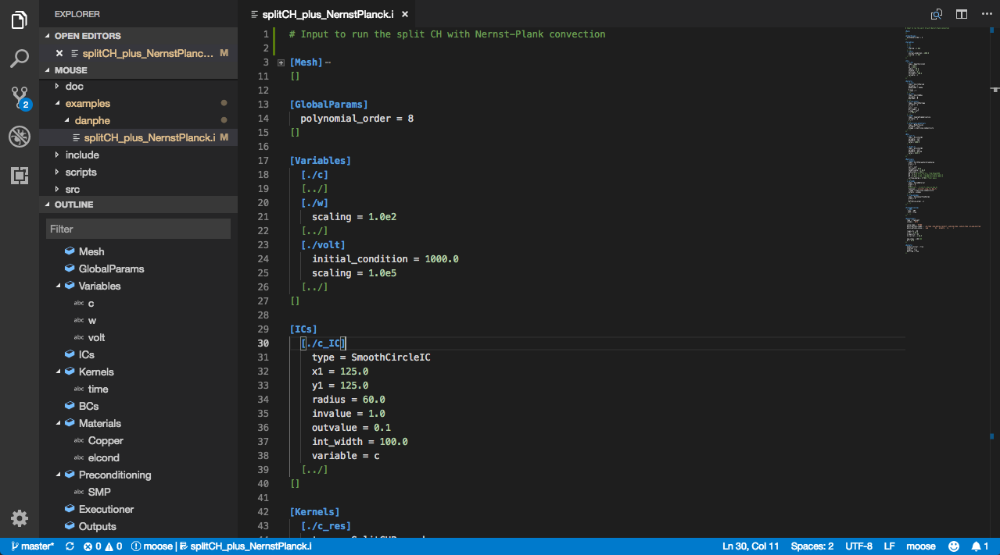
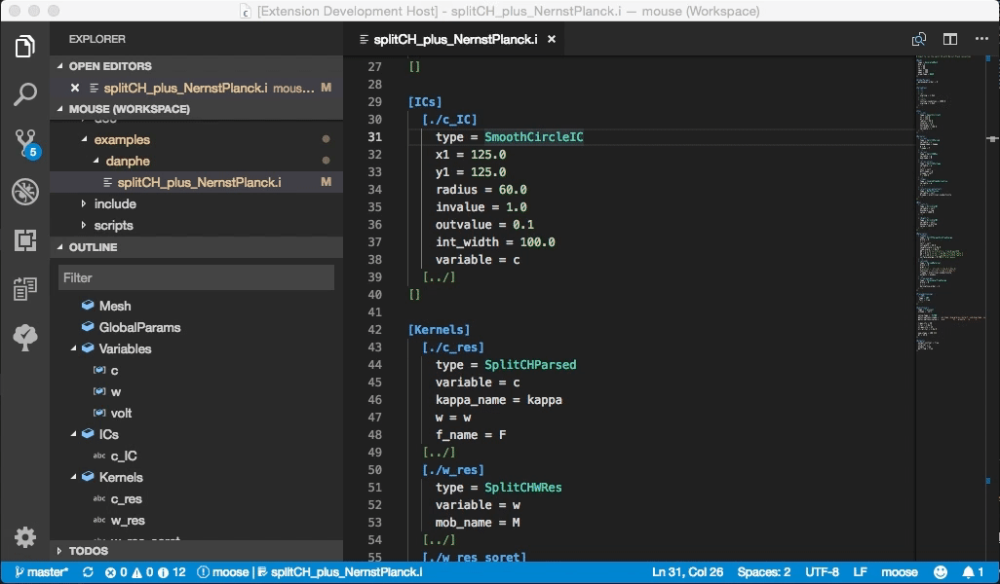
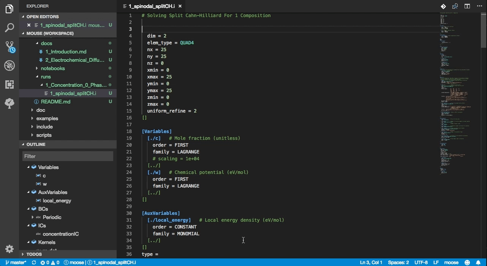
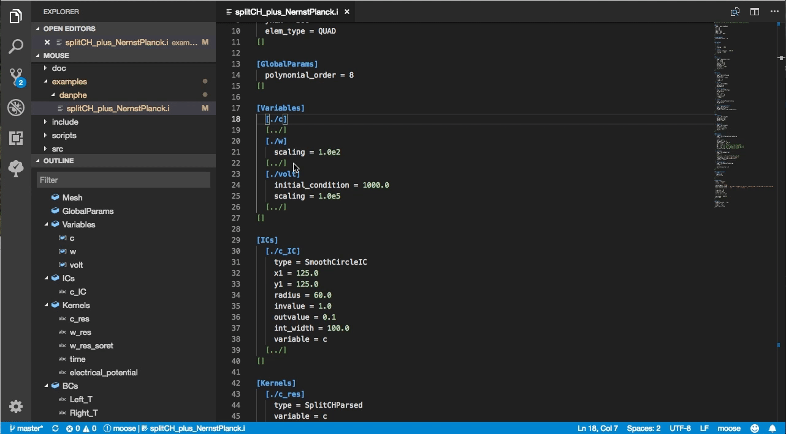

# VSCode for MOOSE

This extension provides language support and IntelliSense for input files of MOOSE (Multiphysics Object Oriented Simulation Environment) applications.

Github Repo: https://github.com/chrisjsewell/vscode-moose

## Features

- Syntax Highlighting
- Input Block Folding
- Input Blocks Outline View
- Hover/Peek/GoTo Definitions of MOOSE Objects
- Autocomplete block names and MOOSE Objects
- Find/Peek All References to Variables
- Main/Sub-Block snippets

### IntelliSense

VSCode for MOOSE builds a mapping of MOOSE object names to their defining source file (<NAME>.C) within the workspace.

Note that multiple folders can be added to a workspace by: `File -> Add Folder To Workspace...`.
Therefore, in order to create mappings for core MOOSE objects, the main MOOSE library folder should be added to the workspace.

Rules for inclusion/exclusion of file and folder regexes are user controllable *via* [Settings](#settings).

### Hover/Peek/GoTo Definitions

The C/C++ extension is required for syntax highlighting of the C file.

Hovering over MOOSE objects attempts to retrieve the text residing in `addClassDescription`.

### Autocomplete

Autocompletion triggers:

- for Blocks is triggered after typing `[`,
- for Moose Objects is triggered after typing `type =`,

### Find/Peek All References

Looks for all references on the right side of `=` assignments,
and initialisations (as sub-blocks) in Variables/AuxVariables.

## Settings

Settings are configured in `Preferences -> Settings`:

| Name                         | Description                                                                                                          |
| ---------------------------- | -------------------------------------------------------------------------------------------------------------------- |
| `moose.exclude.workspaces`   | Specifies the workspace regexes to ignore when searching for MOOSE objects                                           |
| `moose.exclude.relpaths`     | Specifies the path regexes (relative to workspaces) to ignore when searching for MOOSE objects                       |
| `moose.include.modules`      | Specifies the moose module folders to search in for MOOSE Objects (`**/modules/<MODULE>/src/<TYPE>/*.C`)             |
| `moose.include.types`        | Specifies the src subfolders to search in for MOOSE Objects (`**/framework/src/<TYPE>/*.C`)                          |
| `moose.include.relpaths`     | Specifies additional path regexes (relative to workspaces) to search for MOOSE Objects                               |

## Commands

Accessed with `Cmnd+Shift+P`:

- `MOOSE: Reset MOOSE Objects Database`

## How to install from Marketplace

This extension is hosted at Visual Studio Marketplace

1. Upgrade to Visual Studio Code 1.15.0 or above.
2. Switch to the Extensions view by clicking the fifth icon in the left most bar.
3. Type “moose” in the search box and hit the Enter key.
4. Click “Install” button to install “MOOSE for VSCode” extension.

## Release Notes

### 0.0.1

Initial release, including syntax colouring, code folding and outline view

### 0.0.2

Fixed bug for Sub-Block names containing _

### 0.1.0

Added Autocomplete block names, Find/Peek All References to Variables, and Main/Sub-Block snippets

### 0.2.0

Added syntax colouring of moose objects and 'Go To'/'Peek' Definitions

### 0.3.0

Added MOOSE object autocompletion

### 0.4.0

Added MOOSE object hovering

### 0.5.0

Added MOOSE descriptions in autocomplete and auto-update of MOOSE objects

### 0.6.0

Renamed settings keys (and added ignore workspace option)